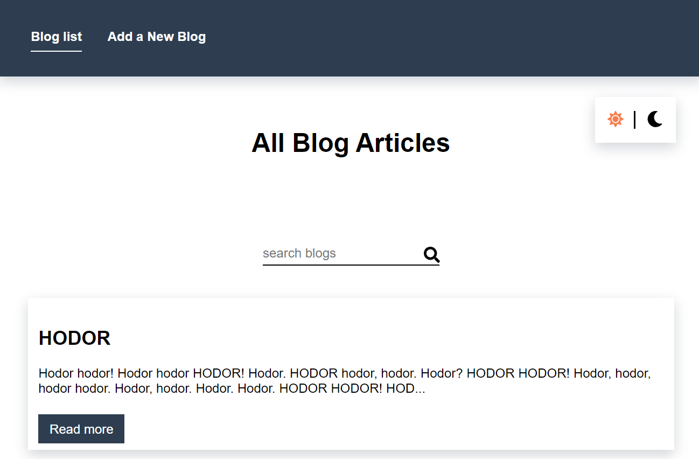

# simple-blog-app 📝📌

Here is an application for browsing and adding new blogs. This app uses [Firebase](https://firebase.google.com/) to store data !

Netlify - [Live!](https://simple-blog-app.netlify.com/)

## Project setup
```
npm install
```

### Compiles and hot-reloads for development
```
npm run serve
```

### Compiles and minifies for production
```
npm run build
```

### Run your tests
```
npm run test
```

### Technologies used

- HTML/HTML5,
- SASS,
- JavaScript/ES6,
- Vue JS (router, resource),
- [Font Awesome](https://fontawesome.com/icons?d=gallery)
- NPM Scripts

